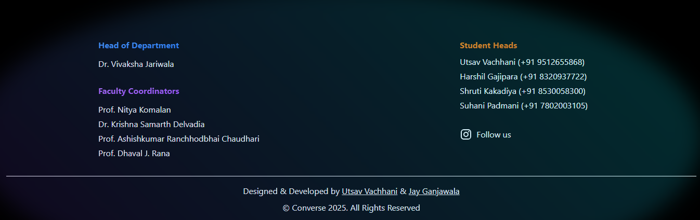
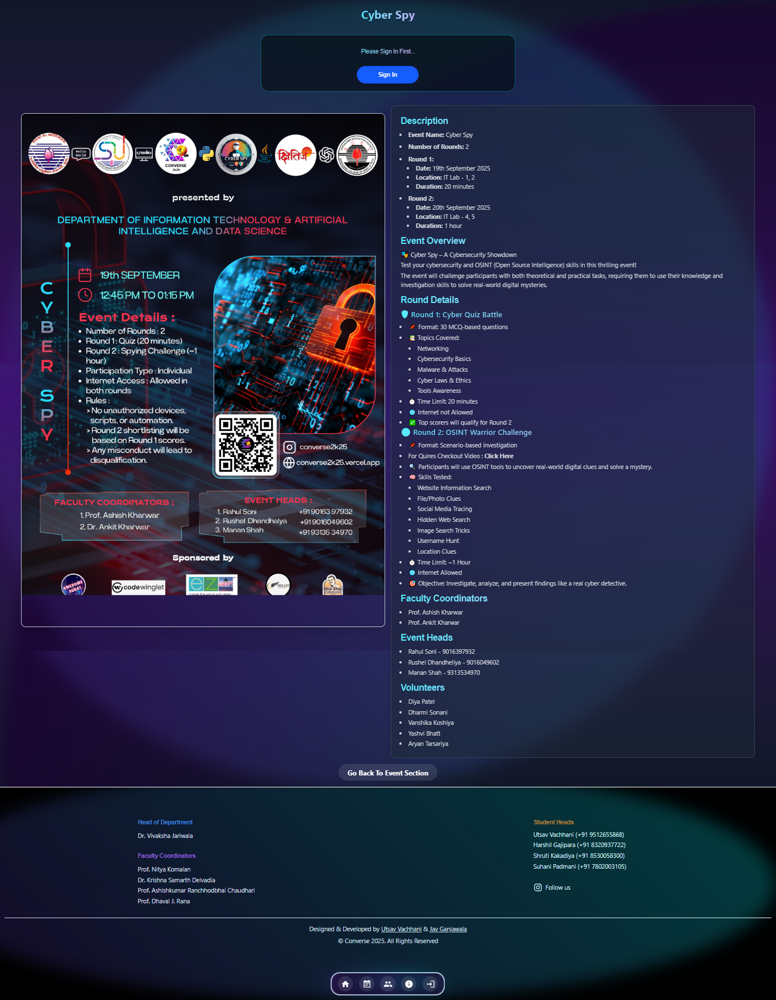

# 🗣️ Converse 2K25 — Official Project

> 🚀 A heartfelt thank you to everyone who made this project possible.

This project was developed as part of the **Converse 2K25** tech event, under the leadership of **Utsav Vachhani** (Event Head). It’s a modern, full-stack web application designed with care — combining powerful backend technologies and a beautifully crafted frontend UI.

Converse2K25 goes beyond the traditional MERN stack by integrating:
- ⚛️ **React + Vite** for fast, modern frontend development  
- 🌐 **Node.js + Express** for scalable backend APIs  
- ☁️ **MongoDB Atlas** for robust database management  
- 🔥 **Firebase** for authentication and realtime features  
- 📊 **Google Sheets API** for dynamic data exports  
- 🎨 A stunning UI designed by [**Jay Ganjawala**](https://github.com/Jay-ganjawala)

📍 **Live Demo:** [converse2k25.vercel.app](http://converse2k25.vercel.app/)

Whether you're here to learn, contribute, or just explore — welcome!  
This project is open-source, educational, and built to inspire.

---

## ✅ Project Structure for GitHub: `converse2k25`

### 📁 Directory Tree

```plaintext
converse2k25/
├── client/               # Frontend: Vite + React
│   ├── public/
│   ├── src/
│   ├── .env.example
│   ├── vite.config.js
│   └── package.json
│
├── server/               # Backend: Express + MongoDB
│   ├── models/
│   ├── routes/
│   ├── controllers/
│   ├── .env.example
│   ├── server.js
│   └── package.json
│
├── googlesheets.md       # Instructions for Google Sheets integration
├── README.md             # Main project README
├── LICENSE               # (Optional) Open-source license
└── .gitignore
```

---

## 📝 README.md Template (for root)

Here’s a well-structured template you can paste into your `README.md` file:

---

````markdown
# 🗣️ Converse2K25

A modern full-stack real-time chat app with Google authentication, MongoDB backend, and Firebase features — beautifully designed and open for the community.

> 🔥 Live Demo: [converse2k25.vercel.app](http://converse2k25.vercel.app/)

---

## 📦 Tech Stack

| Frontend        | Backend         | Database     | Auth & APIs       |
|----------------|------------------|--------------|-------------------|
| React + Vite   | Node.js + Express | MongoDB Atlas | Firebase, Google OAuth |
| Tailwind CSS   | Nodemailer        | Firebase RTDB | Google Sheets API |

---

## 🙌 Special Thanks

🎨 Huge thanks to **Jay Ganjawala** for the beautiful and functional UI design.

---

## 📁 Project Structure

```bash
converse2k25/
├── client/       # Vite + React Frontend
├── server/       # Node.js + Express Backend
````

Each folder has its own `README.md` and `.env.example` file for configuration.

---

## ⚙️ Getting Started

### Clone the repository

```bash
git clone https://github.com/utsavvachhani/converse2k25.git
cd converse2k25
```

---

### 1. Setup Frontend (Client)

```bash
cd client
cp .env.example .env      # Fill in your credentials
npm install
npm run dev
```

---

### 2. Setup Backend (Server)

```bash
cd server
cp .env.example .env      # Fill in your credentials (MongoDB, JWT, Firebase, etc.)
npm install
npm run dev               # Or: node server.js
```

---

### 3. Environment Variables

Both client and server have `.env.example` files to help you set up required credentials. You’ll need:

* Google Client ID
* MongoDB Connection String
* Firebase Config
* JWT Secret
* Email credentials (if Nodemailer is used)

---

### 🔄 Firebase to Google Sheets

Check [`googlesheets.md`](./googlesheets.md) for how to export data from Firebase to Google Sheets using Google Sheets API.

---

## 🚀 Deployment

### Frontend

Deployed on [Vercel](https://vercel.com/)
📍 [converse2k25.vercel.app](http://converse2k25.vercel.app/)

### Backend

You can deploy on:

* Vercel (serverless)
* Render / Railway / Heroku
* Or host locally (on `http://localhost:5000`)

---

## 📷 Screenshots




---

Sure! Here's the **updated `🤝 Contributing`** section with GitHub profile links added for both you and Jay Ganjawala:

---

## 🤝 Contributing

We welcome contributions from the community!
This project is proudly maintained by:

* 👨‍💻 [**Utsav Vachhani**](https://github.com/utsavvachhani) — Backend, Firebase Integration, Full-Stack Management
* 🎨 [**Jay Ganjawala**](https://github.com/Jay-ganjawala) — UI/UX Design & Frontend Enhancements

---

## 📬 Contact

Created by [Utsav Vachhani](https://github.com/utsavvachhani)
Questions or feedback? Open an issue or reach out!

````

---

## 🔐 Example `.env.example` Files

### `client/.env.example`
```env
VITE_GOOGLE_CLIENT_ID=your-google-client-id
VITE_API_BASE_URL=http://localhost:5000
````

### `server/.env.example`

```env
PORT=5000
CONNECTION_URL=your-mongodb-uri
JWT_SECRET=your-jwt-secret
EMAIL_USER=your-email@example.com
EMAIL_PASS=your-email-password
FIREBASE_API_KEY=your-firebase-api-key
FIREBASE_AUTH_DOMAIN=your-firebase-auth-domain
FIREBASE_DATABASE_URL=your-firebase-db-url
FIREBASE_PROJECT_ID=your-firebase-project-id
FIREBASE_STORAGE_BUCKET=your-firebase-bucket
FIREBASE_MESSAGING_SENDER_ID=your-firebase-sender-id
FIREBASE_APP_ID=your-firebase-app-id
FIREBASE_MEASUREMENT_ID=your-firebase-measurement-id
```

---

## 📄 `googlesheets.md` Sample Contents

This file should explain how to:

* Authenticate with Google Sheets API
* Install required libraries
* Export Firebase data into a Sheet

Let me know if you want help writing this file.

---

## ✅ Final To-Dos for You

* [ ] Add `.env.example` files in both `client/` and `server/`
* [ ] Clean your `.gitignore`
* [ ] Add the above `README.md` in root
* [ ] Add screenshots of the app
* [ ] (Optional) Write simple `client/README.md` and `server/README.md`
* [ ] Push it all to GitHub
